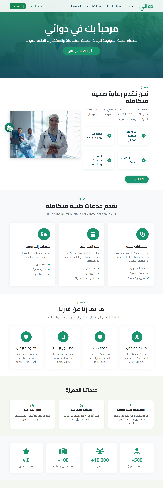
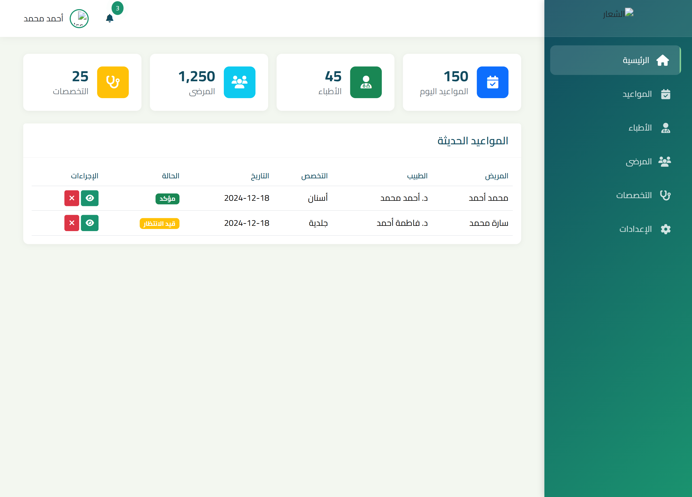
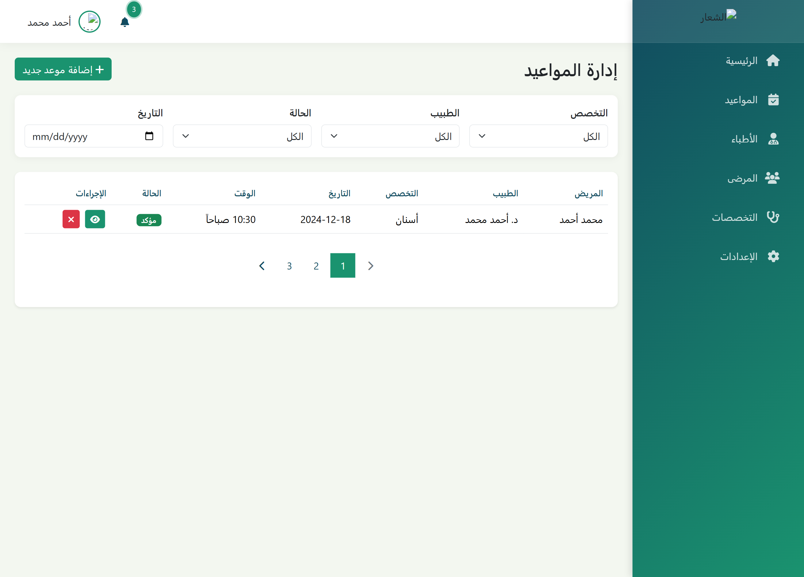
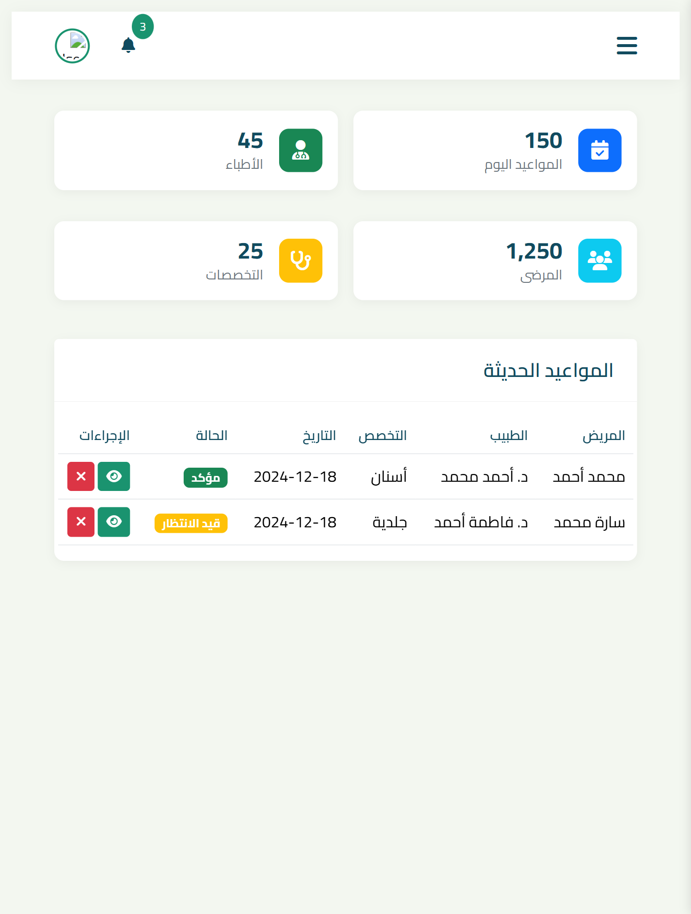
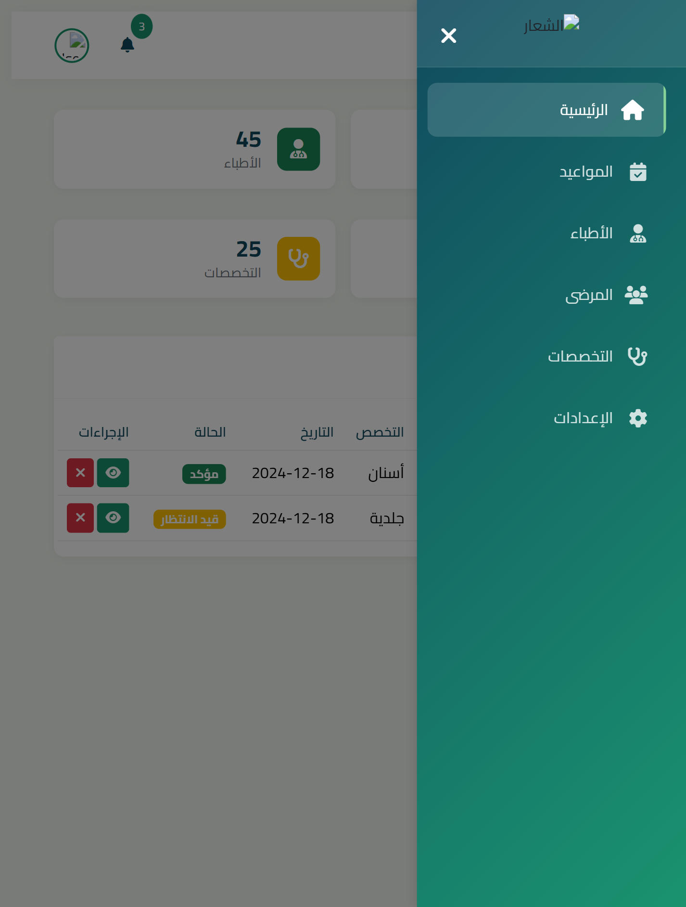

# Dawai Medical Website

A modern Arabic medical platform built with Bootstrap 5, featuring a responsive design and comprehensive admin dashboard.

## Core Technologies

[](https://getbootstrap.com/)
[](https://www.w3.org/Style/CSS/)
[](https://developer.mozilla.org/en-US/docs/Web/JavaScript)

## Technical Architecture

### Frontend Components
- Bootstrap 5 Grid System
- Custom CSS Components
- Responsive Navigation
- RTL Support for Arabic
- Interactive Forms
- Custom JavaScript Modules

### Admin Dashboard Features
- Bootstrap 5 Admin Template
- Data Management Interface
- Responsive Tables
- Form Validation
- Custom Admin Controls

## Screenshots

### Main Website


### Administrative Interface
| Component | Screenshot |
|-----------|------------|
| Dashboard |  |
| Appointments |  |

### Responsive Design
<table>
  <tr>
    <td><strong>Mobile Dashboard</strong></td>
    <td><strong>Mobile Navigation</strong></td>
  </tr>
  <tr>
    <td></td>
    <td></td>
  </tr>
</table>

## Technical Implementation

### Bootstrap 5 Components Used
- Grid System
- Navigation Components
- Cards
- Forms
- Tables
- Modals
- Alerts
- Utilities

### Custom Features
- RTL Layout Implementation
- Custom Form Validation
- Interactive Appointment System
- Dashboard Analytics
- Data Management System

## Setup and Installation

```bash
# Project Structure
dawai-medical/
├── css/
│   ├── bootstrap.rtl.min.css
│   └── style.css
├── js/
│   ├── bootstrap.bundle.min.js
│   └── main.js
└── admin/
    ├── css/
    └── js/
```

### Requirements
- Modern Browser Support
- Bootstrap 5.0+
- JavaScript ES6+

## Browser Compatibility
- Chrome (latest)
- Firefox (latest)
- Safari (latest)
- Edge (latest)

## Project Structure
- `/css` - Style files and Bootstrap RTL
- `/js` - JavaScript modules
- `/admin` - Dashboard components
- `/image` - Media assets

## Performance Optimization
- Minified Bootstrap files
- Optimized images
- Cached resources
- Lazy loading implementation

## Documentation
For detailed documentation about specific components and features, please refer to:
- [Bootstrap 5 Docs](https://getbootstrap.com/docs/5.2/getting-started/introduction/)
